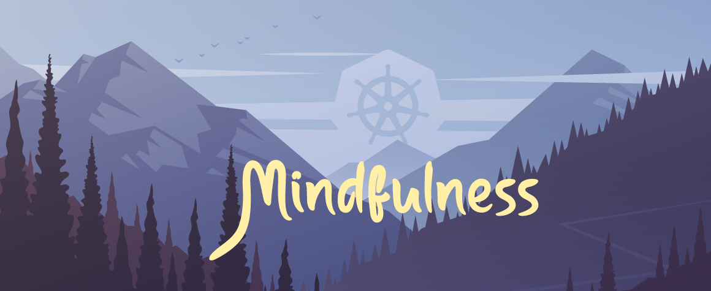

# Kubernetes Mindfulness Service

## Technical Goal

This project aims to demonstrate you can deploy a simple production web application to Kubernetes to a managed service provider utilizing standard Kubernetes components and third-party services.

## Scenario

A non-profit organization has received government funding to leverage cloud-native services for building public services accessible online. The org has hired you as their (only) Cloud-Native/Kubernetes Engineer.

### Feature Requirements

The mindfulness app is accessible via any web browser.
The mindfulness app consists of a single page that displays a breathing exercise that the user can perform.

eg. two deep breaths, one short breath

The breathing excerise must change every 15 minutes.

There should be between 50 to 100 different breathing excerises

### Business Requirements

The government funding works in two parts:
1. The non-profit will be provided funding to hire an engineer (that's you) to build a production-ready prototype
2. The non-profit will only receive ongoing funding to retain the engineer and maintain the service cost if the organization submits a: Architectural Diagram, a Technical Journal, a Cost Analysis, A Security Analysis.

 #### Architectural Diagram

A PDF architectural diagram showing as much possible detail of the final architecture will need to be submitted to the government to obtain funding.

 #### Technical Journal

There is concern that if the engineer (you) were to leave the project, the next person would not know what to do to carry on the project or may not understand your decisions.

Another concern is that the service in question is only a production prototype and will be pulled down while the organization awaits approval for the second level of funding.

A Technical Journal is required to mitigate the concerns
The Technical journal is composed of different digital documents, Work Log, Technical Steps:

 ##### Technical Steps

In the technical steps digital document, you need to write out all the technical steps taken. Similar to writing a tutorial. 

 ##### Work Log

In this document, every day you decide to work on the project, you describe what you plan to do today, what you think the solution will be, and the outcome (regardless of whether it was successful or failure.)
 
#### Security Analysis

While the app does not contain any sensitive organizational data or stores user data, you must describe the security of your service. Do your best here to meet what you think are the requirements.

#### Cost Anaylsis

The government needs to know the monthly spending to receive funding for ongoing costs.

For two years out, a detailed breakdown of cost for three years out with the assumption there will be an increase in traffic and usage. (It is up to you to describe what the increase in capacity will be)

You can factor in extra labour if it's not as simple as scaling to more machines.
 
## Third-Party Consultant Recommedations

To obtain the initial funding, the organization had to by requirement consult a third-party Cloud-Native Engineer on how the service should be built. Therefore, you need to try and meet these requirements.

🚨 📖 Please Read All Requirements before getting started

- [1. Building the application](#1-building-the-application)
- [2. Managed database service](#2-managed-database-service)
- [3. Containerizing the application](#3-containerizing-the-application)
- [4. Managed Cloud Service Provider (CSPs)](#4-managed-cloud-service-provider-csps)
- [5. External Load Balanacer](#5-external-load-balanacer)
- [6. Domain Name](#6-domain-name)
- [7. Encyption-in-Transit](#7-encyption-in-transit)
- [8. Scheduled CronJob](#8-scheduled-cronjob)
- [9. General Availability and AutoScaling](#9-general-availability-and-autoscaling)
- [10. Right-sizing Pods](#10-right-sizing-pods)
- [11. Multiple Fault Zones (Optional, Bonus Points)](#11-multiple-fault-zones-optional-bonus-points)
- [12. Cluster Autoscaling (Optional Big Bonus Points](#12-cluster-autoscaling-optional-big-bonus-points)
- [13. Block Storage and Snapshots](#13-block-storage-and-snapshots)
- [14. Namespace](#14-namespace)
- [15. Role Based Acess Controls (RBAC)](#15-role-based-acess-controls-rbac)
- [16. Deployment](#16-deployment)
- [17. Service Mesh](#17-service-mesh)

### 1. Building the application

The web-application requirements is single web-app.

You can build this web-application using any web-framework. Here are some examples.
- Ruby on Rails
- Sinatra
- Laravel
- Flask

The web-application needs to retrieve a record from a single table of a relational database.
You can either use:
- MySQL
- Postgres
- MariaDB

### 2. Managed database service

While you could use Stateful Sets to deploy the database within the cluster, the consultant specifically said to use a managed service by a Cloud Service Provider (CSPs).

Examples of managed relational database services:
- Amazon Relational Database Service (RDS)
- Azure Database for MySQL or Postgres
- Google Cloud SQL for MySQL or Postgres

You will need to use a Kubernetes ExternalName Service

### 3. Containerizing the application

Once you have built the web-application you need to ensure it can run in its own container.

- You need to find an existing base container image that can run your web-framework.
- You need create your own Dockerfile an extend that base image.
- You need to build that image and store it in a container repository. 

### 4. Managed Cloud Service Provider (CSPs)

You need to host the cluster on a managed kuberenetes service.
The following were suggested:

- Elastic Kubernetes Service (EKS)
- Azure Kuberenetes Service (AKS)
- Google Kuberentes Engine (GKE)
- IBM Kubrenetes Service (IKS)
- CIVO Kubernetes Service (CKS)
- Digital Ocean Kubernetes Service (DOKS)

> CIVO does not have a managed relational database service so in this case you'll need to use CIVO alongside another Cloud Service Provider.

Some CSPs have two different options for nodes, Virtual Machines, or Serverless Containers.
You must avoid using serverless containers for the underyling compute for this project.

### 5. External Load Balanacer

In order for traffic to reach the service you will need to leverage the Cloud Service Providers (CSPs) load balanacer.

- You'll need to install an Ingress Controller
- You'll need to create an Kubernetes Ingress

> Make sure you are using the CSPs load balancer, and not the Nginx Ingress Controller. 

### 6. Domain Name

You need a domain name, purchase it or get a free domain name and point it to your service.

### 7. Encyption-in-Transit

The web application needs to run on HTTPS.

### 8. Scheduled CronJob

A Kubernetes CronJob should run every 15 minutes, and it should update your ConfigMap that stores a reference to the current record that should be retrieved from the database.

### 9. General Availability and AutoScaling

There should always be at least three pods of the web-application running.

You need to create a HorizontalPodAutoscaler and then use a Load-Testing Tool

### 10. Right-sizing Pods

Use an AutoPodVertical scaler to right-size your pods to determine the best CPU and Memory usage.

### 11. Multiple Fault Zones (Optional, Bonus Points)

Run your pods across at least three different fault zones.
A fault zone is a collection of datacenters running in a different location.

eg. AWS calls the Availability Zones. 

> You will have to run at leaast 3 nodes and this will greatly increase cost.

### 12. Cluster Autoscaling (Optional Big Bonus Points)

Implement Cluster Autoscaling so more nodes will be added when using a Load Testing Tool.

### 13. Block Storage and Snapshots

Your pods should utilize Block Storage from a cloud service provide.

You must perform a Kubernetes Volume Snapshot

### 14. Namespace

You need to namespace your web-application in a namespace called "mindfulness"

### 15. Role Based Acess Controls (RBAC)

You need to create a user that can gain access to the cluster but only have read access to all components in the "mindfulness" namespace

### 16. Deployment

You need setup a deployment tool that supports GitOps:
- Argo
- Flux

You need to demostrate that it works with any kind of superfical change to your code to a git repository.

Use need to use a *Blue/Green* deployment strategy

### 16. Service Mesh

Implement a service mesh:
- Istio
- LinkerD

Show that you can view service mesh information from Grapha and Promethous. 